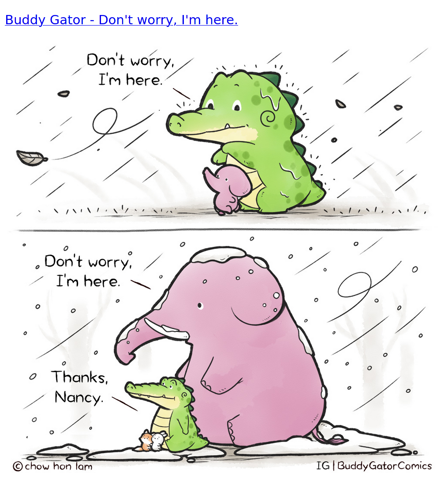

# wholesome

Get a wholesome meme.



## Local use

Set the environment variables `REDDIT_CLIENT_ID` and `REDDIT_CLIENT_SECRET` to
your Reddit client ID and secret.

Clone the repo and `cd` into it. Then run:

```
cargo run
```

Open `http://localhost:3000` in a browser.
